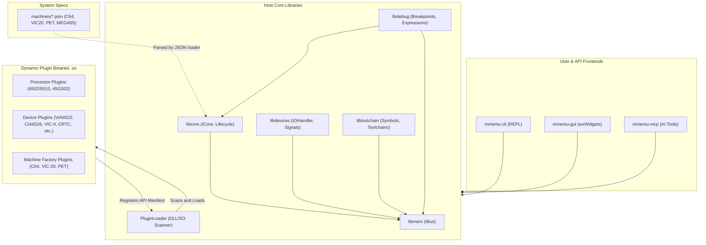

# Multi-Machine Emulator / Simulator (mmsim) Documentation Suite: Architectural Overview and Roadmap

This document serves as the high-level entry point, structural outline, and implementation roadmap for the **mmsim** (Multi-Machine Simulator / Emulator) documentation suite. It introduces the core architecture of the emulator, highlights the separation of concerns between core libraries and dynamic plugins, and provides links to the ten specialized chapters documenting the codebase.

---

## 1. Executive Summary

**mmsim** (Multi-Machine Simulator) is a universal, highly modular 8/16-bit emulation and simulation platform. Unlike monolithic emulators that hardcode a single computer architecture (e.g., just a Commodore 64 or an Atari 800), **mmsim** is designed as a dynamic host framework. CPU cores, address buses, memory layouts, video/audio output controllers, and other virtual hardware components are fully decoupled and can be composed at runtime using JSON descriptors or programmatic C++ specifications.

> [!IMPORTANT]
> **Strict Separation of Concerns Rule**
> To maintain the universality of the core system, machine-specific code must never reside in the core libraries (`libmem`, `libcore`, `libdevices`, `libtoolchain`, `libdebug`). Core libraries contain only machine-agnostic abstractions, registries, and generic helpers. Any class whose name, behavior, or header path implies a specific machine or chip family (e.g., VIC-II, SID, CRTC, or specific RAM banking rules) belongs in the corresponding machine plugin under `src/plugins/`.

---

## 2. Core System Architecture

The emulator core is written in C++ and organized into five decoupled shared libraries situated under [src](file:///home/duck/m65/inpg/mmsim/src):

```
src/
├── libmem/            # Memory bus modeling and address translation
├── libcore/           # CPU core abstractions, configuration, and machine lifecycle
├── libdevices/        # Device interfaces, interrupts, signals, and ports
├── libtoolchain/      # Integrated assembler/disassembler backends and symbols
└── libdebug/          # Breakpoints, watchpoints, trace history, and expressions
```

### 2.1 libmem (Abstract Address Bus Model)
Provides the base memory interface and bus routing.
- **Directory**: [src/libmem](file:///home/duck/m65/inpg/mmsim/src/libmem)
- **Primary Interface**: [IBus](file:///home/duck/m65/inpg/mmsim/src/libmem/main/ibus.h#L55) in [ibus.h](file:///home/duck/m65/inpg/mmsim/src/libmem/main/ibus.h)
- **Implementations**:
  - [MemoryBus](file:///home/duck/m65/inpg/mmsim/src/libmem/main/memory_bus.h#L13) in [memory_bus.h](file:///home/duck/m65/inpg/mmsim/src/libmem/main/memory_bus.h) — A flat memory block with support for overlays, read/write hooks, and callback routing.
  - [SparseMemoryBus](file:///home/duck/m65/inpg/mmsim/src/libmem/main/sparse_memory_bus.h#L14) in [sparse_memory_bus.h](file:///home/duck/m65/inpg/mmsim/src/libmem/main/sparse_memory_bus.h) — Efficient memory bus utilizing chunk-based allocations for very large or sparse address spaces.

### 2.2 libcore (Generic CPU & Machine Lifecycle)
Handles CPU register layouts, instructions, execution stepping, and machine initialization from JSON metadata.
- **Directory**: [src/libcore](file:///home/duck/m65/inpg/mmsim/src/libcore)
- **Primary Interfaces**:
  - [ICore](file:///home/duck/m65/inpg/mmsim/src/libcore/main/icore.h#L85) in [icore.h](file:///home/duck/m65/inpg/mmsim/src/libcore/main/icore.h) — Defines standard CPU execution controls (`step()`, `reset()`), interrupt triggers (`triggerIrq()`, `triggerNmi()`), and bus attachments.
  - [ICpuRegs](file:///home/duck/m65/inpg/mmsim/src/libcore/main/icore.h#L55) in [icore.h](file:///home/duck/m65/inpg/mmsim/src/libcore/main/icore.h) — Abstract access to registers (register count, descriptions, read/write operations) using integer indexes or register names.
  - [IMapController](file:///home/duck/m65/inpg/mmsim/src/include/imap_controller.h#L19) in [imap_controller.h](file:///home/duck/m65/inpg/mmsim/src/include/imap_controller.h) — Standard interface for hardware memory-mapping controllers (such as the 45GS02 `MAP` instruction) allowing the CPU and MMU to decouple.
- **Key Modules**:
  - [JsonMachineLoader](file:///home/duck/m65/inpg/mmsim/src/libcore/main/json_machine_loader.h#L12) in [json_machine_loader.h](file:///home/duck/m65/inpg/mmsim/src/libcore/main/json_machine_loader.h) — Parses machine JSON specifications in the `machines/` directory to automatically construct the physical bus, wire up CPU cores, instantiate peripheral devices, load ROMs, and connect signal lines.
  - [CoreRegistry](file:///home/duck/m65/inpg/mmsim/src/libcore/main/core_registry.h#L9) in [core_registry.h](file:///home/duck/m65/inpg/mmsim/src/libcore/main/core_registry.h) — Central directory of available CPU types.

### 2.3 libdevices (Hardware & I/O Infrastructure)
Declares interfaces for memory-mapped peripherals, keyboard matrices, interrupt handlers, and signal wires.
- **Directory**: [src/libdevices](file:///home/duck/m65/inpg/mmsim/src/libdevices)
- **Primary Interfaces**:
  - [IOHandler](file:///home/duck/m65/inpg/mmsim/src/libdevices/main/io_handler.h#L15) in [io_handler.h](file:///home/duck/m65/inpg/mmsim/src/libdevices/main/io_handler.h) — Base class for all virtual chips. Implements standard callback attachment methods for lines (IRQ, NMI, CA1, etc.), DMA buses, and keyboard capture.
  - [ISignalLine](file:///home/duck/m65/inpg/mmsim/src/libdevices/main/isignal_line.h#L9) in [isignal_line.h](file:///home/duck/m65/inpg/mmsim/src/libdevices/main/isignal_line.h) — Abstract connection pin (high/low state, pulse notification).
  - [IKeyboardDevice](file:///home/duck/m65/inpg/mmsim/src/libdevices/main/ikeyboard_device.h#L9) in [ikeyboard_device.h](file:///home/duck/m65/inpg/mmsim/src/libdevices/main/ikeyboard_device.h) and [IKeyboardMatrix](file:///home/duck/m65/inpg/mmsim/src/libdevices/main/ikeyboard_matrix.h#L9) in [ikeyboard_matrix.h](file:///home/duck/m65/inpg/mmsim/src/libdevices/main/ikeyboard_matrix.h) — Interfaces for virtual keyboard key matrix captures and state conversions.
  - [IVideoOutput](file:///home/duck/m65/inpg/mmsim/src/libdevices/main/ivideo_output.h#L9) in [ivideo_output.h](file:///home/duck/m65/inpg/mmsim/src/libdevices/main/ivideo_output.h) & [IAudioOutput](file:///home/duck/m65/inpg/mmsim/src/libdevices/main/iaudio_output.h#L9) in [iaudio_output.h](file:///home/duck/m65/inpg/mmsim/src/libdevices/main/iaudio_output.h) — Abstractions for output buffers rendered by display processors and synthesized by audio chips.
- **Key Modules**:
  - [SharedIrqManager](file:///home/duck/m65/inpg/mmsim/src/libdevices/main/shared_irq_manager.h#L12) in [shared_irq_manager.h](file:///home/duck/m65/inpg/mmsim/src/libdevices/main/shared_irq_manager.h) — Resolves multiple devices pulling down a shared active-low interrupt line, common in Commodore architectures.

### 2.4 libtoolchain (Assembly & Symbol Table Services)
Provides assembly and disassembly abstraction, runtime symbol registration, and binary loader helpers.
- **Directory**: [src/libtoolchain](file:///home/duck/m65/inpg/mmsim/src/libtoolchain)
- **Primary Interfaces**:
  - [IAssembler](file:///home/duck/m65/inpg/mmsim/src/libtoolchain/main/iassembler.h#L17) in [iassembler.h](file:///home/duck/m65/inpg/mmsim/src/libtoolchain/main/iassembler.h) — Interface for source and line-based assemblers.
  - [IDisassembler](file:///home/duck/m65/inpg/mmsim/src/libtoolchain/main/idisasm.h#L15) in [idisasm.h](file:///home/duck/m65/inpg/mmsim/src/libtoolchain/main/idisasm.h) — Interface for translating binary instruction streams back into assembly.
- **Key Modules**:
  - [SymbolTable](file:///home/duck/m65/inpg/mmsim/src/libtoolchain/main/symbol_table.h#L14) in [symbol_table.h](file:///home/duck/m65/inpg/mmsim/src/libtoolchain/main/symbol_table.h) — Maintains label-to-address mappings, searches, and loaders from `.sym` symbol files.

### 2.5 libdebug (Evaluation, Breakpoints, and Diagnostics)
Maintains system diagnostics, breakpoints, program call stacks, and expression evaluations.
- **Directory**: [src/libdebug](file:///home/duck/m65/inpg/mmsim/src/libdebug)
- **Primary Interfaces**:
  - [ExecutionObserver](file:///home/duck/m65/inpg/mmsim/src/libdebug/main/execution_observer.h#L13) in [execution_observer.h](file:///home/duck/m65/inpg/mmsim/src/libdebug/main/execution_observer.h) — Listens to CPU memory accesses, opcode executions, and register updates for breakpoints and diagnostics.
- **Key Modules**:
  - [DebugContext](file:///home/duck/m65/inpg/mmsim/src/libdebug/main/debug_context.h#L24) in [debug_context.h](file:///home/duck/m65/inpg/mmsim/src/libdebug/main/debug_context.h) — Aggregates breakpoints, watchpoints, stack traces, and heatmap monitoring.
  - [ExpressionEvaluator](file:///home/duck/m65/inpg/mmsim/src/libdebug/main/expression_evaluator.h#L14) in [expression_evaluator.h](file:///home/duck/m65/inpg/mmsim/src/libdebug/main/expression_evaluator.h) — Implements a robust recursive-descent math parser, supporting binary/hex representation, symbols, and status flags (e.g., `@PC == $C000 && .Z == 1`).

---

## 3. Architecture Flow & Relationships

The following Mermaid diagram outlines the system topology: how CLI, GUI, and MCP frontends interact with core host libraries, how plugins are dynamically registered, and how hardware descriptions structure runtime virtual machine configurations.



---

## 4. The Plugin Ecosystem & Dynamic Loading

The system decouples hardware complexity from the host emulator executable through a plugin system. At startup, the host scans for library files matching `mmemu-plugin-*.so` (e.g., in `./lib/`, `~/.local/lib/mmsim/plugins/`, etc.) using the [PluginLoader](file:///home/duck/m65/inpg/mmsim/src/plugin_loader/main/plugin_loader.h#L11).

### 4.1 The C ABI Entry Point
Every plugin must export a single, C-compatible function:

```c
extern "C" SimPluginManifest* mmemuPluginInit(const SimPluginHostAPI* host);
```

- **[SimPluginHostAPI](file:///home/duck/m65/inpg/mmsim/src/include/mmemu_plugin_api.h#L90)**: Provides host services to the plugin (logging methods, core/device registries, image loaders, extension hooks for GUI panes, CLI commands, and MCP tools).
- **[SimPluginManifest](file:///home/duck/m65/inpg/mmsim/src/include/mmemu_plugin_api.h#L182)**: Declares plugin metadata, dependency lists, and pointers to arrays of factory functions for CPU cores, toolchains, device handlers, machine descriptors, and loader utilities.

---

## 5. Documentation Chapters

The documentation suite has been compiled into ten individual files:

1. **[Chapter 1: Core Infrastructure and Bus Layout](file:///home/duck/m65/inpg/mmsim/doc/chapter_1_core_bus.md)** — Addresses memory configurations, translation logic, flat/sparse structures, and observer boundaries.
2. **[Chapter 2: The Plugin Ecosystem & Dynamic Loading](file:///home/duck/m65/inpg/mmsim/doc/chapter_2_plugins.md)** — Outlines standard plugin loading routines, search paths, and dynamic API manifest structures.
3. **[Chapter 3: Processor CPU Cores](file:///home/duck/m65/inpg/mmsim/doc/chapter_3_cpu_cores.md)** — Covers registers, instruction cycles, BCD math, and the 45GS02 hypervisor.
4. **[Chapter 4: I/O Device Framework and Legacy Peripherals](file:///home/duck/m65/inpg/mmsim/doc/chapter_4_devices.md)** — Evaluates signals, keyboard matrices, interrupt handlers, and interface adapters.
5. **[Chapter 5: Video & Audio Subsystems](file:///home/duck/m65/inpg/mmsim/doc/chapter_5_video_audio.md)** — Documents scanline updates, character ROM offsets, hardware sprites, and SID envelope generators.
6. **[Chapter 6: Machine Configurations & JSON Descriptors](file:///home/duck/m65/inpg/mmsim/doc/chapter_6_machines.md)** — Walks through preset specs, JSON mappings, and PLA banking configurations.
7. **[Chapter 7: The Toolchain: Assemblers and Disassemblers](file:///home/duck/m65/inpg/mmsim/doc/chapter_7_toolchain.md)** — Details single-line assemblers, KickAssembler listings, and GDB symbol resolution.
8. **[Chapter 8: Debugging and Diagnostics Architecture](file:///home/duck/m65/inpg/mmsim/doc/chapter_8_debug.md)** — Breaks down physical breakpoints, execution heat-mapping, snapshots, and backward tracing.
9. **[Chapter 9: User and AI Interfaces (CLI, GUI, MCP)](file:///home/duck/m65/inpg/mmsim/doc/chapter_9_interfaces.md)** — Covers interactive console REPLs, wxWidgets layouts, MCP tool integrations, and GDB RSP TCP server loops.
10. **[Chapter 10: Testing, Verification, and Automation](file:///home/duck/m65/inpg/mmsim/doc/chapter_10_testing.md)** — Inspects unit validation tests, simulator exit traps, and HyperSerial debug loggers.
