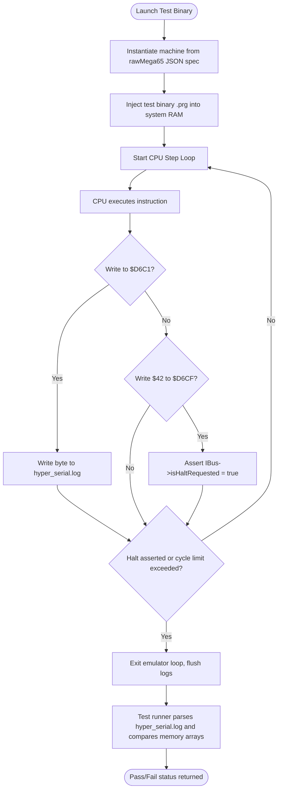

# mmsim Chapter 10: Testing, Verification, and Automation

## 1. Objectives & Scope
This chapter documents the automated verification, continuous integration testing, and diagnostic reporting tools built into **mmsim**. It covers unit testing suites, execution tracking stubs like the `HyperSerial` logger, program completion signaling using `ExitTrap`, and shell validation harnesses that ensure emulation correctness.

## 2. Directory & File Reference
- [tests/src](file:///home/duck/m65/inpg/mmsim/tests/src) — Unit test files (disk directory parsing, tape handling, chip validation).
- [test_harness.h](file:///home/duck/m65/inpg/mmsim/tests/src/test_harness.h) — Base class for setting up test environments and verifying memory assertions.
- [README-EXIT-TRAP.md](file:///home/duck/m65/inpg/mmsim/doc/README-EXIT-TRAP.md) — Documentation for the virtual simulator exit trap device.
- [README-HYPER-SERIAL.md](file:///home/duck/m65/inpg/mmsim/doc/README-HYPER-SERIAL.md) — Documentation for the virtual serial log printing device.

---

## 3. Core Class & Interface Definitions

### 3.1 ExitTrapDevice
Located in the `exit_trap` plugin.
- A virtual device mapped to address `$D6CF` (by default in MEGA65 test configurations).
- **Operation**: Monitors writes to its base address. Writing the magic value `$42` asserts a halt request via [IBus::isHaltRequested](file:///home/duck/m65/inpg/mmsim/src/libmem/main/ibus.h#L75), letting the host console stop execution and exit with status code 0.

### 3.2 HyperSerialDevice
Located in the `hyper_serial` plugin.
- Mapped to address `$D6C0` (Status register) and `$D6C1` (Data register) to simulate a UART interface.
- Writing to `$D6C1` appends the character directly to a host-side debug log (`hyper_serial.log`).

### 3.3 TestHarness
Located at [test_harness.h:L10](file:///home/duck/m65/inpg/mmsim/tests/src/test_harness.h#L10).
- Instantiates a minimal machine environment for test execution.
- Contains macros to verify memory writes, stack depths, register states, and cycle counts.

---

## 4. Subsystem Architecture & Execution Flow

For automated tests (e.g., verifying CPU opcodes), the test runner loads a test binary into the virtual machine, starts execution, and waits for a halt trigger from the `ExitTrap` device.

---

## 5. Integration Details & Cross-Module Wiring

1. **MEGA65 Chip Verification**: The test file [test_mega65_chips.cpp](file:///home/duck/m65/inpg/mmsim/tests/src/test_mega65_chips.cpp) creates a simulated system, runs instructions on the 45GS02 CPU, and validates register changes (A, X, Y, Z, B), BCD decimal behavior, and memory mapping.
2. **CBM Disk Image Tests**: [test_cbm_disk_images.cpp](file:///home/duck/m65/inpg/mmsim/tests/src/test_cbm_disk_images.cpp) verifies high-level file loaders, checking sector offsets and track allocation mappings in `.d64` and `.d81` disk files.
3. **Continuous Integration Hooks**: Automated build scripts execute `./tests/run_tests` after compiling. If the exit trap is never hit, a timeout terminates execution and reports a failure.

---

## 6. Diagnostic & Debugging Hooks

- **HyperSerial Logging**: If a test fails, developers can check `hyper_serial.log` to see a trace of output characters leading up to the crash.
- **Cycle Count Audits**: Test assertions check `cpu->cycles()` to verify that instructions execute within standard hardware timing requirements.
