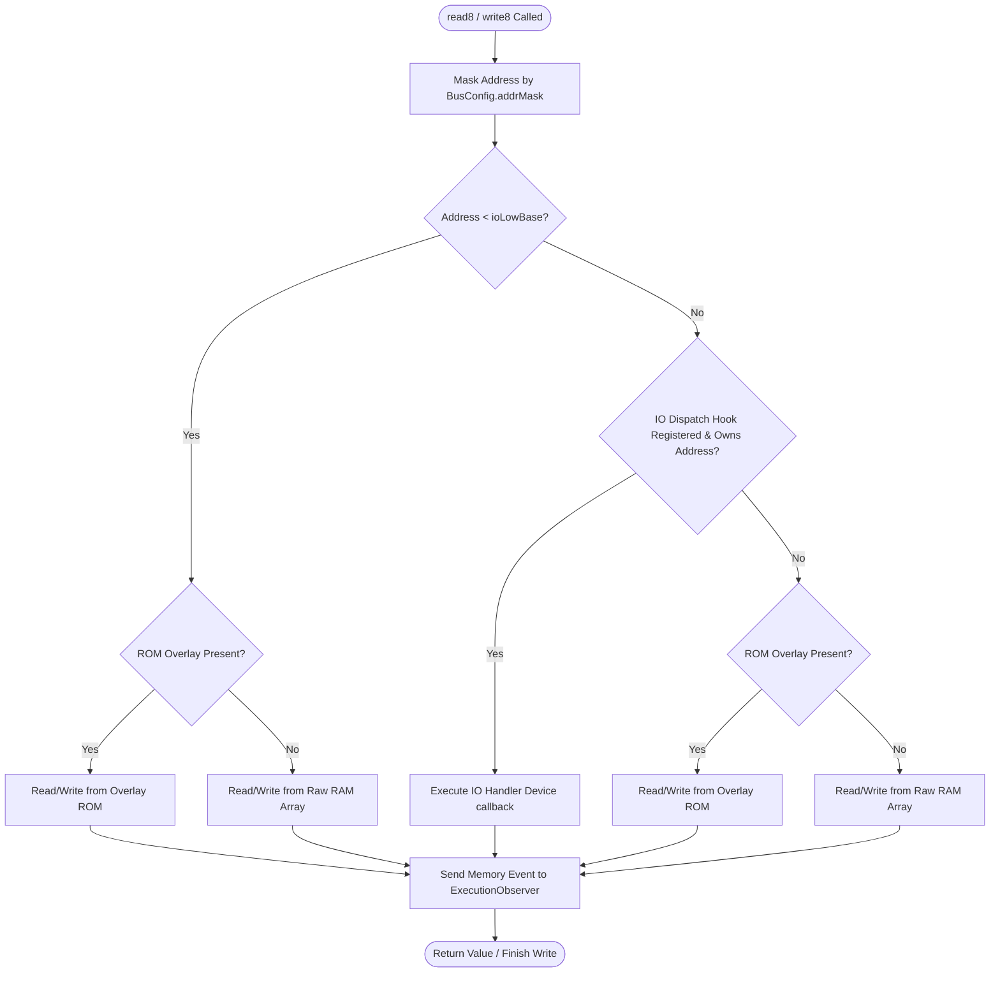

# mmsim Chapter 1: Core Infrastructure and Bus Layout

## 1. Objectives & Scope
This chapter documents the foundational address bus and processor core abstractions present in **mmsim**. These subsystems provide the memory management and CPU execution infrastructure of the emulator, defining how CPU cores communicate with address spaces and how physical machine structures are represented.

## 2. Directory & File Reference
- [ibus.h](file:///home/duck/m65/inpg/mmsim/src/libmem/main/ibus.h) — Base definitions for address bus structures, write logs, and snapshots.
- [memory_bus.h](file:///home/duck/m65/inpg/mmsim/src/libmem/main/memory_bus.h) — Declares `FlatMemoryBus` (also referred to as `FlatMemoryBus`).
- [memory_bus.cpp](file:///home/duck/m65/inpg/mmsim/src/libmem/main/memory_bus.cpp) — Implementation of flat memory space mapping, overlays, and hooks.
- [sparse_memory_bus.h](file:///home/duck/m65/inpg/mmsim/src/libmem/main/sparse_memory_bus.h) — Declares chunk-allocated `SparseMemoryBus` for large physical address maps.
- [sparse_memory_bus.cpp](file:///home/duck/m65/inpg/mmsim/src/libmem/main/sparse_memory_bus.cpp) — Implementation of sparse page mapping.
- [icore.h](file:///home/duck/m65/inpg/mmsim/src/libcore/main/icore.h) — CPU interfaces (`ICore`, `ICpuRegs`, `ICpuDisasm`).
- [imap_controller.h](file:///home/duck/m65/inpg/mmsim/src/include/imap_controller.h) — Dynamic memory mapping translator interface.

---

## 3. Core Class & Interface Definitions

### 3.1 IBus
Interface located at [ibus.h:L55](file:///home/duck/m65/inpg/mmsim/src/libmem/main/ibus.h#L55). It abstracts read/write operations to isolate CPU cores from the physical architecture of the target machine.
- `read8(uint32_t addr)`: Reads an 8-bit value. If the address matches an I/O device hook, it redirects execution to the registered device.
- `write8(uint32_t addr, uint8_t val)`: Writes an 8-bit value, checking overlays and I/O hooks.
- `peek8(uint32_t addr)`: Inspects memory without causing side effects (used by debuggers).
- `addRomOverlay(uint32_t base, uint32_t size, const uint8_t* data)`: Overlays a ROM block. Writes to this range are ignored by default.

### 3.2 FlatMemoryBus
Located at [memory_bus.h:L34](file:///home/duck/m65/inpg/mmsim/src/libmem/main/memory_bus.h#L34). A direct, flat memory implementation.
- Manages an array of size $2^{\text{addrBits}}$.
- Supports `setIoHooks()` for registering lambda functions that intercept reads and writes in I/O ranges (typically `$D000–$DFFF`).
- Provides `read8Raw()` to bypass registered overlays and hooks, accessing standard RAM.

### 3.3 SparseMemoryBus
Located at [sparse_memory_bus.h:L26](file:///home/duck/m65/inpg/mmsim/src/libmem/main/sparse_memory_bus.h#L26).
- Utilizes page allocations of 4 KB (`1 << 12` bytes) mapped in `std::unordered_map<uint32_t, uint8_t*>`.
- Pages are allocated on-demand during writes, optimizing RAM usage for 28-bit physical maps (e.g., MEGA65).

### 3.4 ICore
Located at [icore.h:L85](file:///home/duck/m65/inpg/mmsim/src/libcore/main/icore.h#L85). Represents a generic CPU core.
- `step()`: Executes a single instruction and returns the elapsed system cycles.
- `triggerIrq()`, `triggerNmi()`, `triggerReset()`: Pins driven by system signal changes.
- `setDataBus(IBus* bus)`, `setCodeBus(IBus* bus)`, `setIoBus(IBus* bus)`: Supports Harvard architectures by allowing code and data buses to be fully separated.

---

## 4. Subsystem Architecture & Execution Flow

The memory resolution path logic is structured to check overlays first, then I/O dispatch hooks, and finally back to raw system RAM.

---

## 5. Integration Details & Cross-Module Wiring

Memory buses are instantiated by the JSON configuration loader.
1. The bus is configured with its bit-width (e.g., 16-bit for $64\text{ KB}$, 28-bit for $256\text{ MB}$).
2. An I/O block is defined using the base address. Reads and writes exceeding this address are intercepted via a callback that queries the `IORegistry` to find the correct `IOHandler`.
3. CPU cores are associated with the bus via `setDataBus` and `setCodeBus`. Every memory cycle of the CPU calls `bus->read8` or `bus->write8`, which propagates signals down the observers.

---

## 6. Diagnostic & Debugging Hooks

All memory read/write operations notify an attached [ExecutionObserver](file:///home/duck/m65/inpg/mmsim/src/libdebug/main/execution_observer.h#L13) if present. This allows `libdebug` to:
- Intercept instructions prior to execution.
- Maintain write counts and logs through `IBusWriteLog` (retrieved via `getWrites`).
- Track memory access frequency to generate hot-maps.
