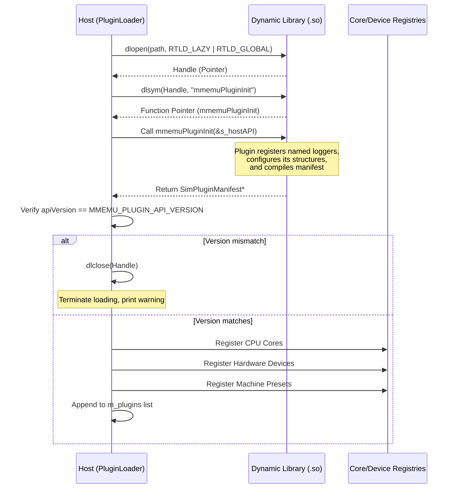

# mmsim Chapter 2: The Plugin Ecosystem & Dynamic Loading

## 1. Objectives & Scope
This chapter documents the dynamic loading subsystem and C ABI boundaries of the **mmsim** plugin engine. It details how the host discovers shared library plugins, verifies ABI version compatibility, registers plugin-provided components with internal core registries, and forwards extension endpoints to the user-facing CLI, GUI, and MCP frontends.

## 2. Directory & File Reference
- [plugin_loader.h](file:///home/duck/m65/inpg/mmsim/src/plugin_loader/main/plugin_loader.h) — Declares `PluginLoader` singleton lifecycle driver.
- [plugin_loader.cpp](file:///home/duck/m65/inpg/mmsim/src/plugin_loader/main/plugin_loader.cpp) — Implements search, dynamic linkage (`dlopen`), verification, and registry forwarding.
- [mmemu_plugin_api.h](file:///home/duck/m65/inpg/mmsim/src/include/mmemu_plugin_api.h) — Public C interface specifying the ABI, host API pointers, and plugin manifests.

---

## 3. Core Class & Interface Definitions

### 3.1 PluginLoader
Located at [plugin_loader.h:L7](file:///home/duck/m65/inpg/mmsim/src/plugin_loader/main/plugin_loader.h#L7). It acts as the central plugin controller.
- `load(const std::string& path)`: Direct loading of a single shared library `.so` file. Loads the binary into memory using `dlopen(path, RTLD_LAZY | RTLD_GLOBAL)`.
- `loadFromDir(const std::string& dir)`: Scans a target directory, finding files matching `mmemu-plugin-*.so`.
- `loadFromStandardLocations()`: Implements fallback path search hierarchy.
- `setPaneRegisterFn()`, `setCommandRegisterFn()`, `setMcpToolRegisterFn()`: Sets function pointer callbacks to route plugin UI elements, console operations, and AI tools back to the respective frontend dispatch tables.

### 3.2 SimPluginHostAPI
Structure defined at [mmemu_plugin_api.h:L90](file:///home/duck/m65/inpg/mmsim/src/include/mmemu_plugin_api.h#L90). It provides host services to the plugin, eliminating direct linkage to C++ classes.
- `log`: Named logs targeting host logging streams.
- Registry creators: `createCore`, `createDevice`, `createMachine`, `createDisassembler`, `createAssembler`.
- UI/Tool extension bounds: `registerPane`, `registerCommand`, `registerMcpTool`.

### 3.3 SimPluginManifest
Structure defined at [mmemu_plugin_api.h:L182](file:///home/duck/m65/inpg/mmsim/src/include/mmemu_plugin_api.h#L182). Contains metadata and arrays of plugin items registered with the host at boot time:
- `cores` (`CorePluginInfo` arrays).
- `toolchains` (`ToolchainPluginInfo` arrays).
- `devices` (`DevicePluginInfo` arrays).
- `machines` (`MachinePluginInfo` arrays).
- `loaders` (`ImageLoaderPluginInfo` arrays).

---

## 4. Subsystem Architecture & Execution Flow

The dynamic loading sequence operates on standard POSIX dynamic loading (`dl`) functions. It validates and parses the manifest returned by `mmemuPluginInit`.

---

## 5. Integration Details & Cross-Module Wiring

1. **Standard Search Hierarchy**: The boot loader scans locations in the following sequence:
   - `./lib/` (development working directory)
   - `~/.local/lib/mmsim/plugins/` (user installation)
   - `/usr/local/lib/mmsim/plugins/` (local admin)
   - `/usr/lib/mmsim/plugins/` (package manager installation)
2. **Dynamic UI Routing**: When `mmemu-gui` initializes, it sets the callback in `PluginLoader` for register pane mapping (`setPaneRegisterFn`). If a plugin manifest defines a tab or window in `PluginPaneInfo`, the host GUI dynamically adds this tab into the wxWidgets layout.

---

## 6. Diagnostic & Debugging Hooks

Plugin initialization issues are logged to the host standard logging pipeline (`system` logger):
- If `dlopen` fails, the error message returned by `dlerror()` is captured and reported at `ERROR` level.
- ABI major version checks verify if the upper 16 bits of the version are identical (`apiVersion >> 16`). Mismatches cause the host to ignore the plugin and call `dlclose` immediately.
