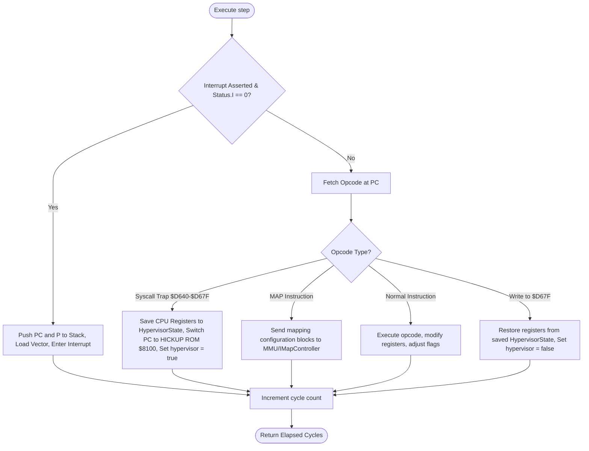

# mmsim Chapter 3: Processor CPU Cores

## 1. Objectives & Scope
This chapter documents the CPU cores implemented in **mmsim** as dynamic plugins. It covers the legacy MOS 6502 (NMOS) core, the C64's MOS 6510 core with integrated I/O ports, and the advanced 45GS02 processor used by the MEGA65 simulator, including its 28-bit memory mapping and privileged Hypervisor (HYPPO) mode.

## 2. Directory & File Reference
- [cpu6502.h](file:///home/duck/m65/inpg/mmsim/src/plugins/6502/main/cpu6502.h) — Declares `MOS6502` CPU core structure.
- [cpu6502.cpp](file:///home/duck/m65/inpg/mmsim/src/plugins/6502/main/cpu6502.cpp) — Implements 6502 instruction cycle steps and illegal opcodes.
- [cpu6510.h](file:///home/duck/m65/inpg/mmsim/src/plugins/6502/main/cpu6510.h) — Declares `MOS6510` C64-specific processor structure.
- [cpu6510.cpp](file:///home/duck/m65/inpg/mmsim/src/plugins/6502/main/cpu6510.cpp) — Implements CPU on-chip I/O port registers at addresses `$00` and `$01`.
- [cpu45gs02.h](file:///home/duck/m65/inpg/mmsim/src/plugins/45gs02/main/cpu45gs02.h) — Declares `MOS45GS02` CPU core structure and hypervisor states.
- [cpu45gs02.cpp](file:///home/duck/m65/inpg/mmsim/src/plugins/45gs02/main/cpu45gs02.cpp) — Implements 45GS02 instruction set (including 32-bit Quad operations, `MAP`, and syscall traps).

---

## 3. Core Class & Interface Definitions

### 3.1 MOS6502
Located at [cpu6502.h:L13](file:///home/duck/m65/inpg/mmsim/src/plugins/6502/main/cpu6502.h#L13). NMOS 6502 emulation.
- **Registers**: A, X, Y, SP (8-bit page-1 stack pointer), PC, P (Status register: `NV-BDIZC`).
- Supports standard instruction execution decoding via nested `switch` blocks in `step()`.
- Implements illegal/undocumented opcodes (e.g., `LAX`, `SAX`, `DCP`, `ISB`) for high compatibility with C64 and VIC-20 software.

### 3.2 MOS6510
Located at [cpu6510.h:L11](file:///home/duck/m65/inpg/mmsim/src/plugins/6502/main/cpu6510.h#L11). Inherits from `MOS6502`.
- Integrates an internal 6-bit bi-directional I/O port mapped to addresses `$0000` (Data Direction Register - DDR) and `$0001` (Accumulator Port).
- Read/write operations to `$00`/`$01` bypass the standard system data bus and assert signals (such as `LORAM`, `HIRAM`, and `CHAREN`) driven to the PLA banking chip.

### 3.3 MOS45GS02
Located at [cpu45gs02.h:L63](file:///home/duck/m65/inpg/mmsim/src/plugins/45gs02/main/cpu45gs02.h#L63).
- **Extended Registers**: Adds `Z` (third index register), `B` (Base page relocator), and a full 16-bit Stack Pointer (`SP`).
- **MAP Instruction**: Sets active memory mapping state. During execution, it signals the attached [IMapController](file:///home/duck/m65/inpg/mmsim/src/include/imap_controller.h#L19) to translate 16-bit virtual memory requests to 28-bit physical bus addresses.
- **Quad Mode**: Supports 32-bit register operations (Qaccumulator) and mathematical accelerations.

---

## 4. Subsystem Architecture & Execution Flow

The 45GS02 CPU execution flow handles standard instructions, syscall traps, hypervisor entry/exit conditions, and BCD decimal adjustments.

---

## 5. Integration Details & Cross-Module Wiring

1. **6510 Port Intercept**: In [cpu6510.cpp](file:///home/duck/m65/inpg/mmsim/src/plugins/6502/main/cpu6510.cpp), reads and writes to `$0000` and `$0001` intercept data-bus transfers. When values are written to `$0001`, the CPU asserts the corresponding output lines (mapped to system signals). The `SharedSignalLine` propagates this change to the C64 PLA device, triggering banks to swap in or out instantly.
2. **Hypervisor ROM (HYPPO)**: On startup, the `MOS45GS02` checks for a hypervisor ROM image named `HICKUP.M65`. The binary is loaded into a dedicated 16 KB segment. When a user-mode application writes to addresses in the `$D640-$D67F` range, the CPU automatically swaps in `HICKUP.M65` at `$8000-$BFFF` and branches to `$8100`.

---

## 6. Diagnostic & Debugging Hooks

- **Register Exposure**: Standard CPU registers are mapped to UI-facing indexes. The CLI `regs` command queries `regCount()` and displays them according to the current CPU type (e.g., displaying `Z` and `B` on 45GS02, but hiding them on 6502).
- **Status Flag Parsing**: Bit layouts (such as `NV-BDIZC`) are decoded on-the-fly. The expression evaluator uses the `.` prefix (e.g. `.Z`) to inspect status flags and the `@` prefix (e.g. `@PC`) to read register states during breakpoint checks.
- **Hypervisor Visibility**: The `regs` command lists whether the CPU is currently operating in hypervisor mode by checking the `hypervisor` boolean flag.
