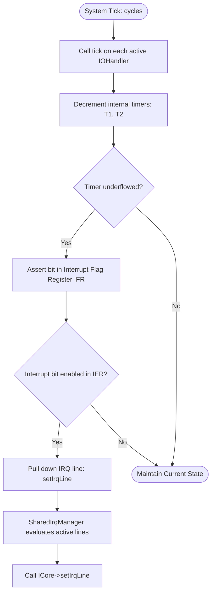

# mmsim Chapter 4: I/O Device Framework and Legacy Peripherals

## 1. Objectives & Scope
This chapter documents the peripheral device framework and dynamic legacy interface adapters simulated in **mmsim**. It details how the generic [IOHandler](file:///home/duck/m65/inpg/mmsim/src/libdevices/main/io_handler.h#L15) base class is used to wrap memory-mapped hardware chips, how interrupts and signal lines are routed between components, and the internal operations of legacy peripherals like the MOS 6522 VIA, MOS 6526 CIA, MOS 6520 PIA, and the Commodore Datasette cassette model.

## 2. Directory & File Reference
- [io_handler.h](file:///home/duck/m65/inpg/mmsim/src/libdevices/main/io_handler.h) — Base class for all memory-mapped virtual hardware.
- [isignal_line.h](file:///home/duck/m65/inpg/mmsim/src/libdevices/main/isignal_line.h) — Pin and signal routing abstractions.
- [shared_irq_manager.h](file:///home/duck/m65/inpg/mmsim/src/libdevices/main/shared_irq_manager.h) — Manages multiple interrupt lines pulling down a shared line.
- [via6522.h](file:///home/duck/m65/inpg/mmsim/src/plugins/devices/via6522/main/via6522.h) — MOS 6522 Versatile Interface Adapter (VIA) implementation.
- [cia6526.h](file:///home/duck/m65/inpg/mmsim/src/plugins/devices/cia6526/main/cia6526.h) (under `src/plugins/devices/cia6526/main/`) — MOS 6526 Complex Interface Adapter (CIA) implementation.
- [pia6520.h](file:///home/duck/m65/inpg/mmsim/src/plugins/devices/pia6520/main/pia6520.h) (under `src/plugins/devices/pia6520/main/`) — MOS 6520 Peripheral Interface Adapter (PIA) implementation.
- [datasette.h](file:///home/duck/m65/inpg/mmsim/src/plugins/devices/datasette/main/) — Datasette Tape deck emulation.

---

## 3. Core Class & Interface Definitions

### 3.1 IOHandler
Located at [io_handler.h:L15](file:///home/duck/m65/inpg/mmsim/src/libdevices/main/io_handler.h#L15).
- Abstract interface that maps dynamic devices to the physical bus.
- `ioRead(IBus* bus, uint32_t addr, uint8_t* val)`: Intercepts reads to the device's assigned address range. Returns `true` if handled.
- `ioWrite(IBus* bus, uint32_t addr, uint8_t val)`: Intercepts writes to the device's assigned address range.
- `tick(uint64_t cycles)`: Executes internal operations (e.g., timer decrements) synchronized to the master clock.

### 3.2 ISignalLine
Located at [isignal_line.h:L9](file:///home/duck/m65/inpg/mmsim/src/libdevices/main/isignal_line.h#L9).
- Simplifies pin wiring.
- `set(bool level)`: Assert or deassert a signal.
- `get()`: Reads the current logical level.
- `pulse()`: Triggers a rapid edge transition (e.g., vertical sync pulse).

### 3.3 VIA6522
Located at [via6522.h:L13](file:///home/duck/m65/inpg/mmsim/src/plugins/devices/via6522/main/via6522.h#L13).
- Implements dual 8-bit ports (PORT A, PORT B), two 16-bit timers, a shift register, and handshake control lines (`CA1`, `CA2`, `CB1`, `CB2`).
- Edges on `CA1` or `CB1` trigger interrupt flags in the Interrupt Flag Register (IFR).

### 3.4 CIA6526
- Implements two 8-bit ports, two 16-bit interval timers with underflow interrupts, a Time-of-Day (TOD) clock, and a serial shift register.
- Used in C64 emulation for keyboard matrix scanning and joystick reading.

### 3.5 Datasette (Cassette Tape Drive)
- Simulates tape read/write lines and motor control states.
- Rewinds, records, and plays back `.tap` Commodore tape image formats.
- Supports arming the datasette for capture, saving captured audio pulse patterns back into raw digital file formats.

---

## 4. Subsystem Architecture & Execution Flow

When the system clock increments, ticks are propagated to all registered devices. Timers count down and assert interrupt lines if underflow occurs.

---

## 5. Integration Details & Cross-Module Wiring

1. **Shared Interrupts**: Because many Commodore systems wire both CIA/VIA chips to the same active-low IRQ pin on the CPU, direct connections would overwrite state changes. The [SharedIrqManager](file:///home/duck/m65/inpg/mmsim/src/libdevices/main/shared_irq_manager.h#L12) registers as the target of each chip's `setIrqLine()` and performs a logical `AND` across all inputs before setting the final CPU pin state.
2. **Keyboard Matrix Port Connections**: Keyboards are wired via JSON specs by mapping the output pins of an I/O adapter's port (e.g., CIA1 Port A) to rows, and the input pins of another port (e.g., CIA1 Port B) to columns. When the CPU writes a row scan mask, subsequent reads return column pins pulled low by closed keyboard switches.

---

## 6. Diagnostic & Debugging Hooks

- **Interrupt Flags Inspection**: Read operations to IFR/IER registers can be logged using Named Loggers.
- **Datasette Transport State**: The CLI features cassette deck commands (`tape record`, `tape save`) that query datasette buffers and report tape offsets directly to the command interpreter.
- **Port Watchpoints**: Developers can set watchpoints on PORT A and PORT B registers to track external hardware states (e.g., serial line toggles).
