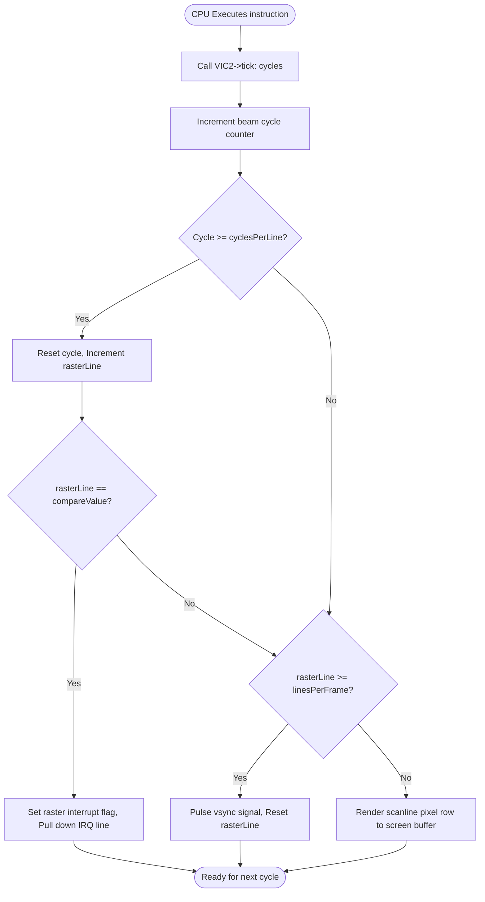

# mmsim Chapter 5: Video & Audio Subsystems

## 1. Objectives & Scope
This chapter documents the video rendering and audio synthesis components simulated in the **mmsim** plugin modules. It explains the timing registers, clock scanline structures, sprite logic, character overlays, and envelope synthesizers that power the display and sound elements of emulated machines.

## 2. Directory & File Reference
- [vic2.h](file:///home/duck/m65/inpg/mmsim/src/plugins/devices/vic2/main/vic2.h) — MOS 6567/6569 VIC-II controller interface.
- [vic2.cpp](file:///home/duck/m65/inpg/mmsim/src/plugins/devices/vic2/main/vic2.cpp) — Implementation of video modes, sprites, and raster line interrupts.
- [vic6560.h](file:///home/duck/m65/inpg/mmsim/src/plugins/devices/vic6560/main/vic6560.h) — MOS 6560 VIC-I video/audio controller.
- [crtc6545.h](file:///home/duck/m65/inpg/mmsim/src/plugins/devices/crtc6545/main/crtc6545.h) — MOS 6545/6845 CRTC video controller.
- [sid6581.h](file:///home/duck/m65/inpg/mmsim/src/plugins/devices/sid6581/main/sid6581.h) — MOS 6581 Sound Interface Device (SID) implementation.
- [sid6581.cpp](file:///home/duck/m65/inpg/mmsim/src/plugins/devices/sid6581/main/sid6581.cpp) — Implementation of audio ADSR envelopes and filters.

---

## 3. Core Class & Interface Definitions

### 3.1 IVideoOutput & IAudioOutput
Located under `src/libdevices/main/`.
- **[IVideoOutput](file:///home/duck/m65/inpg/mmsim/src/libdevices/main/ivideo_output.h#L9)**: Interface for getting screen size and rendering output frames.
  - `getVideoBuffer()`: Returns a pointer to raw RGBA8888 pixels.
  - `renderFrame()`: Triggers full frame generation.
- **[IAudioOutput](file:///home/duck/m65/inpg/mmsim/src/libdevices/main/iaudio_output.h#L9)**: Interface for streaming sound buffer channels.
  - `getAudioBuffer(int16_t* out, int samples)`: Flushes generated samples.

### 3.2 VIC2 (VIC-II)
Located at [vic2.h:L45](file:///home/duck/m65/inpg/mmsim/src/plugins/devices/vic2/main/vic2.h#L45).
- Simulates standard/multicolor text and standard/multicolor bitmap modes, as well as extended background color mode (ECM).
- **Sprite Engine**: Manages 8 hardware sprites, supporting size expansions (double width/height), priorities, and pixel-accurate collision detection.
- **Raster Counter**: Advances `m_rasterLine` on each tick. Fires an interrupt when the line matches register `$D012`.

### 3.3 VIC6560 (VIC-I)
- Handles VIC-20 video, keyboard row checks, and simple multi-voice square wave synthesis (3 voices + 1 noise voice).

### 3.4 SID6581
- Emulates 3 independent voices (sawtooth, triangle, pulse with variable duty cycle, and noise).
- Integrates an ADSR (Attack, Decay, Sustain, Release) envelope generator and a low/band/high pass state-variable filter.

---

## 4. Subsystem Architecture & Execution Flow

At each CPU clock cycle step, the video chip updates its raster state. When the screen sync timer triggers, the display buffer is flushed.

---

## 5. Integration Details & Cross-Module Wiring

1. **VIC-II Banking**: Unlike CPU buses, the VIC-II's DMA bus only addresses $16\text{ KB}$ at a time. The bank address is set using CIA2 Port A bits 0–1 (inverted: `%00` selects `$C000–$FFFF`, `%11` selects `$0000–$3FFF`). When CIA2 intercepts a write on Port A, it calls `VIC2->setBankBase(base)`.
2. **Character ROM Overlay**: Inside the selected $16\text{ KB}$ bank, character ROM data is mapped at offsets `$1000–$1FFF` and `$9000–$9FFF`. If character ROM is registered via `setCharRom()`, the VIC-II read routine bypasses system memory and reads directly from the ROM buffer, even if system RAM is mapped at those locations for the CPU.
3. **Color RAM**: The VIC-II holds an independent $1\text{ KB}$ of 4-bit wide color memory. The host connects it by calling `vic2->setColorRam(colorPtr)` at init.

---

## 6. Diagnostic & Debugging Hooks

- **Raster Interrupt Tracking**: Developers can watch register `$D011`/`$D012` to debug copper effects and raster timing loops.
- **Audio Voice Debugging**: The SID chip logs register writes to `$D400–$D41C`. Individual channels can be muted using debug flags to isolate envelope and filter sweeps.
