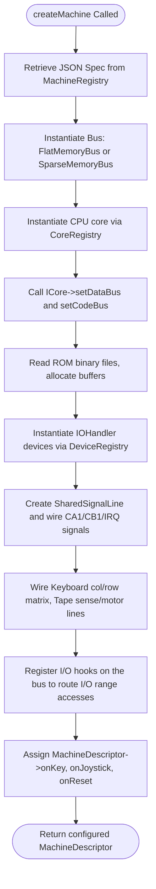

# mmsim Chapter 6: Machine Configurations & JSON Descriptors

## 1. Objectives & Scope
This chapter documents the structure and loading sequence of target machine configurations in **mmsim**. It explains the layout of the JSON machine-description format, how dynamic address spaces, registers, signals, keyboard matrices, tape models, and drive systems are composed from static specifications, and how the loader handles dependencies and presets.

## 2. Directory & File Reference
- [c64.json](file:///home/duck/m65/inpg/mmsim/machines/c64.json) — Composition preset for the Commodore 64.
- [vic20.json](file:///home/duck/m65/inpg/mmsim/machines/vic20.json) — Composition preset for the Commodore VIC-20.
- [pet.json](file:///home/duck/m65/inpg/mmsim/machines/pet.json) — Composition preset for PET series machines.
- [mega65.json](file:///home/duck/m65/inpg/mmsim/machines/mega65.json) — Specification for the high-end 45GS02 MEGA65 machine.
- [README-machines.md](file:///home/duck/m65/inpg/mmsim/machines/README-machines.md) — Technical spec for the JSON machine descriptor format.
- [json_machine_loader.cpp](file:///home/duck/m65/inpg/mmsim/src/libcore/main/json_machine_loader.cpp) — Concrete parser mapping JSON objects to host memory setups.

---

## 3. Core Class & Interface Definitions

### 3.1 MachineDescriptor
Located at [machine_desc.h:L50](file:///home/duck/m65/inpg/mmsim/src/libcore/main/machine_desc.h#L50).
- Encapsulates the entire runtime configuration of an emulated computer.
- Contains slots for CPU cores (`CpuSlot`), address buses (`BusSlot`), memory overlays, registered symbol tables, and key/joystick inputs.
- Automatically handles the destruction of registered sub-objects on shutdown.

### 3.2 JsonMachineLoader
Located at [json_machine_loader.h:L13](file:///home/duck/m65/inpg/mmsim/src/libcore/main/json_machine_loader.h#L13).
- **`loadFile(path)`**: Parses a JSON file, resolves any inheritance chains (e.g., `_extends`), and registers the resulting machine descriptors in the central `MachineRegistry`.
- **`buildFromSpec(spec)`**: Generates a physical virtual machine layout by querying the registries to instantiate the requested components and wiring them together.

---

## 4. Subsystem Architecture & Execution Flow

When a machine is created via CLI or GUI (e.g., `c64`), the loader instantiates core libraries and hooks them together.



---

## 5. Integration Details & Cross-Module Wiring

1. **PLA Wiring (C64 Spec)**: The C64 PLA handles banking. The JSON defines `plaWiring` linking CPU signal outputs (such as `loram`, `hiram`, `charen`) to the PLA input lines. When the CPU writes to `$0001`, these signals propagate to the PLA, swapping overlays (Kernal, BASIC, Character ROM) or mapping in the I/O block at `$D000–$DFFF`.
2. **Keyboard Matrix Wiring**: Keyboard inputs map raw characters to matrix cross-points. The JSON maps row and column ports:
   ```json
   "kbdWiring": {
     "device": "Keyboard",
     "colPort": { "device": "CIA1", "port": "A" },
     "rowPort": { "device": "CIA1", "port": "B" }
   }
   ```
   The loader configures row output writes to trigger column evaluations.
3. **Datasette Wiring**: Tape controls require connecting motor signals, sense flags, and cassette write loops to the correct input adapter pins (e.g. CIA1 FLAG pin for read pulses).

---

## 6. Diagnostic & Debugging Hooks

- **Symbol Autosourcing**: The loader automatically loads symbolic Kernal jump tables (e.g. `roms/c64/kernal.sym`) into the system `SymbolTable`.
- **Specification Inspection**: The `MachineDescriptor` stores a copy of its source JSON spec in `sourceSpec`, allowing CLI tools or AI agents to inspect the peripheral wiring at runtime.
