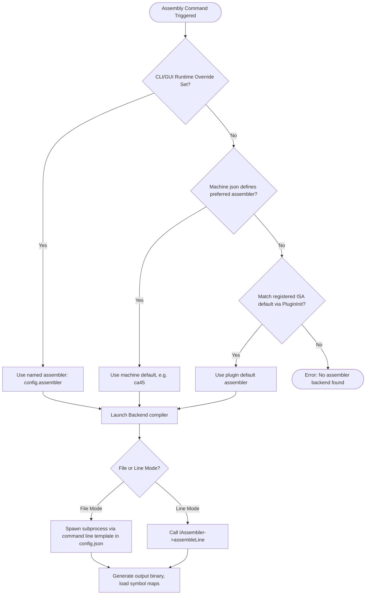

# mmsim Chapter 7: The Toolchain: Assemblers and Disassemblers

## 1. Objectives & Scope
This chapter documents the modular translation utilities situated in the **mmsim** toolchain subsystem (`libtoolchain`). It covers the interfaces used to write multi-ISA assemblers and disassemblers, the symbol table mapping system that bridges raw addresses to human-readable strings during debugging, and the configuration pipeline for launching external compilation binaries (such as the `ca45` assembler).

## 2. Directory & File Reference
- [iassembler.h](file:///home/duck/m65/inpg/mmsim/src/libtoolchain/main/iassembler.h) — Interface specifying file and single-line compilation requirements.
- [idisasm.h](file:///home/duck/m65/inpg/mmsim/src/libtoolchain/main/idisasm.h) — Interface specifying instruction parsing and categorization.
- [symbol_table.h](file:///home/duck/m65/inpg/mmsim/src/libtoolchain/main/symbol_table.h) — Label registry and `.sym` parser.
- [toolchain_registry.h](file:///home/duck/m65/inpg/mmsim/src/libtoolchain/main/toolchain_registry.h) — Global repository of registered compilation tools.
- [README-assemblers.md](file:///home/duck/m65/inpg/mmsim/doc/README-assemblers.md) — User documentation explaining assembler backend configurations and CLI commands.

---

## 3. Core Class & Interface Definitions

### 3.1 IAssembler
Located at [iassembler.h:L34](file:///home/duck/m65/inpg/mmsim/src/libtoolchain/main/iassembler.h#L34).
- Represents a compiler target.
- `assemble(sourcePath, outputPath)`: Assembles a file and outputs a compiled binary (e.g. `.prg`).
- `assembleLine(line, buf, bufsz, addr)`: Generates binary bytes for a single line of assembly (used by interactive debugging REPLs).

### 3.2 IDisassembler
Located at [idisasm.h:L29](file:///home/duck/m65/inpg/mmsim/src/libtoolchain/main/idisasm.h#L29).
- Translates binary memory blocks back to assembly strings.
- `disasmOne(bus, addr, buf, bufsz)`: Disassembles a single instruction into a character buffer. Returns the instruction byte count.
- `disasmEntry(bus, addr, DisasmEntry& entry)`: Populates a structured metadata record containing operation characteristics (`isCall`, `isReturn`, `isBranch`, `isIllegal`) and label destinations.

### 3.3 SymbolTable
Located at [symbol_table.h:L11](file:///home/duck/m65/inpg/mmsim/src/libtoolchain/main/symbol_table.h#L11).
- Maps address integers to string labels and vice-versa.
- `nearest(addr, offset)`: Traverses the registry to find the closest label at or prior to the requested address (useful for indicating offsets in call traces, e.g. `CHROUT + 15`).
- `loadSym(path)`: Imports files using the formats `label = value` or `label value`.

---

## 4. Subsystem Architecture & Execution Flow

When assembling a project, the assembler is resolved using a three-level priority resolution chain, configured globally via `config.json`.

---

## 5. Integration Details & Cross-Module Wiring

1. **KickAssembler Integration**: The `SymbolTable` has native support for reading symbols generated by KickAssembler (`loadKickAssSym()`).
2. **Subprocess Invocation**: For external toolchains like `ca45` (MEGA65 assembler), compilation is initiated via `std::system` or POSIX `fork`/`exec`. Working directories and arguments are passed using values parsed from `./config.json`.
3. **Disassembler Label Resolution**: The disassembler is coupled to the active `SymbolTable`. During `disasmEntry()`, if the target address matches a registered symbol, the disassembler replaces raw hexadecimal branch destinations with the corresponding symbol text (e.g. `JMP $FFD2` becomes `JMP CHROUT`).

---

## 6. Diagnostic & Debugging Hooks

- **Interactive mini-assembler**: Users can type `.lda #$02` in the CLI to test instructions. The REPL calls `assembleLine` and writes the resulting bytes directly to the current program counter address.
- **Illegal Opcode Tracking**: The disassembler marks unofficial instructions by setting the `isIllegal` flag in `DisasmEntry`.
