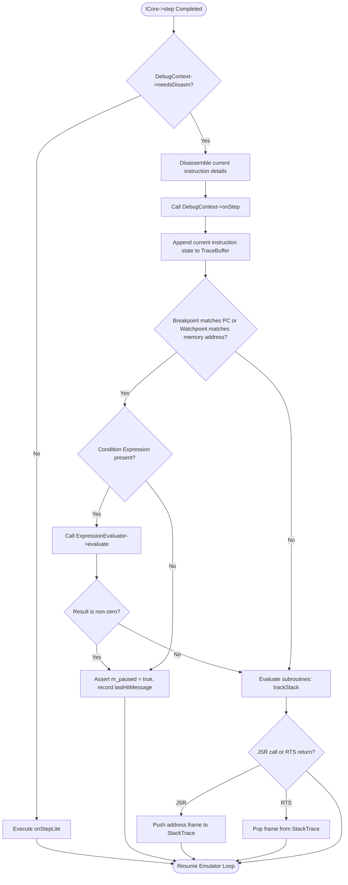

# mmsim Chapter 8: Debugging and Diagnostics Architecture

## 1. Objectives & Scope
This chapter documents the diagnostic and debugging infrastructure situated in the **mmsim** debugging engine (`libdebug`). It details how the emulator monitors memory reads/writes and instruction executions, evaluates breakpoint conditions, builds stack traces, records historical steps for reverse execution, captures snapshots, and tracks memory hot-spots.

## 2. Directory & File Reference
- [debug_context.h](file:///home/duck/m65/inpg/mmsim/src/libdebug/main/debug_context.h) — Declares `DebugContext` manager class.
- [debug_context.cpp](file:///home/duck/m65/inpg/mmsim/src/libdebug/main/debug_context.cpp) — Implementation of snapshot tracking, reverse execution steps, and Kernal/BASIC routine call logging.
- [breakpoint_list.h](file:///home/duck/m65/inpg/mmsim/src/libdebug/main/breakpoint_list.h) — Declares breakpoint and watchpoint lookup registries.
- [expression_evaluator.h](file:///home/duck/m65/inpg/mmsim/src/libdebug/main/expression_evaluator.h) — Declares parser for debugging conditions.
- [execution_observer.h](file:///home/duck/m65/inpg/mmsim/src/libdebug/main/execution_observer.h) — Interception interface hook.
- [trace_buffer.h](file:///home/duck/m65/inpg/mmsim/src/libdebug/main/trace_buffer.h) — Circular trace log storage for reverse-stepping.

---

## 3. Core Class & Interface Definitions

### 3.1 DebugContext
Located at [debug_context.h:L19](file:///home/duck/m65/inpg/mmsim/src/libdebug/main/debug_context.h#L19).
- Inherits from [ExecutionObserver](file:///home/duck/m65/inpg/mmsim/src/libdebug/main/execution_observer.h#L13).
- Orchestrates all sub-components: `m_breakpoints`, `m_trace` (for execution history), `m_stackTrace` (call frame trees), and `m_heatmap`.
- `reverseStep()`: Restores previous register values and memory writes from the trace logs, stepping the CPU backward by one instruction.
- `saveSnapshot()`, `restoreSnapshot()`: Serializes system state (using CPU and Bus `ISnapshotable` implementations).
- `diffSnapshots(idxA, idxB)`: Compares two snapshot dumps and returns modified memory addresses.

### 3.2 BreakpointList
Located at [breakpoint_list.h:L17](file:///home/duck/m65/inpg/mmsim/src/libdebug/main/breakpoint_list.h#L17).
- Maintains execution breakpoints, read/write watchpoints, and conditional checks.
- Breaks execution when conditions evaluate to true.

### 3.3 ExpressionEvaluator
Located at [expression_evaluator.h:L14](file:///home/duck/m65/inpg/mmsim/src/libdebug/main/expression_evaluator.h#L14).
- A recursive-descent parser that evaluates conditions at runtime.
- Supports register shortcuts (`@PC`, `@A`, `@X`) and processor flags (`.Z`, `.C`).

---

## 4. Subsystem Architecture & Execution Flow

During CPU steps, execution events are forwarded to the `DebugContext` to evaluate breakpoints and record traces.

---

## 5. Integration Details & Cross-Module Wiring

1. **System Snapshot Serialization**: Snapshot serialization queries the `MachineDescriptor`. It iterates over all active CPU and Bus interfaces, calling `saveState()` to fill buffer structures. Restoring a snapshot reverses this sequence, invoking `loadState()`.
2. **Kernal and BASIC Logging Traps**: The debugger intercepts standard Commodore Kernal routines. When logging levels are set to `DEBUG`, writing to `JSR $FFD2` (CHROUT) logs registers upon entry, and tracks exit states when the matching `RTS` is popped.
3. **Execution Observers**: The `PluginLoader` exposes `hostRegisterObserver()`, enabling custom plugins to inject their own logging observers.

---

## 6. Diagnostic & Debugging Hooks

- **Reverse Stepping**: The REPL `step -1` command calls `reverseStep()`, returning the machine state to the previous instruction.
- **Heatmap Generation**: `heatmap()` counts reads and writes per address, highlighting memory regions frequently accessed by program loops.
