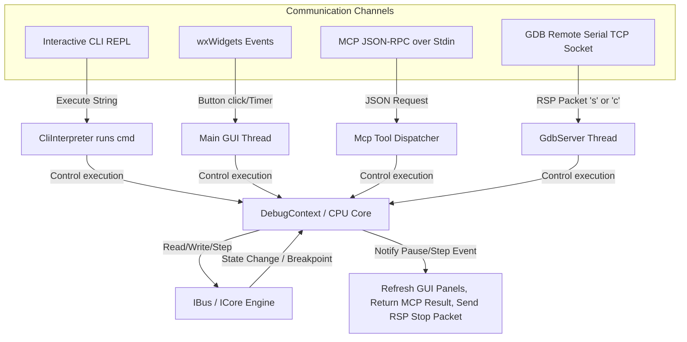

# mmsim Chapter 9: User and AI Interfaces (CLI, GUI, MCP)

## 1. Objectives & Scope
This chapter documents the user-facing and external communication frontends of **mmsim**. It covers the interactive Command Line Interface (CLI) REPL, the wxWidgets graphical debugging environment, the Model Context Protocol (MCP) server that exposes emulator control tools to AI agents, and the GDB Remote Serial Protocol (RSP) stub that allows standard debugger interfaces (like `gdb` or `lldb`) to attach to the emulator.

## 2. Directory & File Reference
- [cli_interpreter.cpp](file:///home/duck/m65/inpg/mmsim/src/cli/main/cli_interpreter.cpp) — Command processor and line interpreter.
- [gdb_server.h](file:///home/duck/m65/inpg/mmsim/src/cli/main/gdb_server.h) — Declares GDB remote debugging server stub.
- [plugin_pane_manager.h](file:///home/duck/m65/inpg/mmsim/src/gui/main/plugin_pane_manager.h) — Dynamic layout tab binder for GUI.
- [main.cpp](file:///home/duck/m65/inpg/mmsim/src/mcp/main/main.cpp) — Entry point and tool definitions for the MCP server.

---

## 3. Core Class & Interface Definitions

### 3.1 CliInterpreter
Located at [cli_interpreter.h:L11](file:///home/duck/m65/inpg/mmsim/src/cli/main/cli_interpreter.h#L11).
- Processes interactive console inputs.
- Implements standard console commands (`step`, `regs`, `asm`, `m` (memory dump), `load`, `swap`).
- Interprets mathematical inputs using the recursive-descent expression evaluator.

### 3.2 GdbServer
Located at [gdb_server.h:L21](file:///home/duck/m65/inpg/mmsim/src/cli/main/gdb_server.h#L21).
- Implements GDB RSP connection protocol in a background worker thread.
- Maps standard GDB register request packets (`g`, `G`) and memory operations (`m`, `M`) to internal CPU register/bus actions.
- Maps 6502 register sequences (A, X, Y, SP, PC, P) to GDB index parameters.

### 3.3 PluginPaneManager
Located at [plugin_pane_manager.h:L17](file:///home/duck/m65/inpg/mmsim/src/gui/main/plugin_pane_manager.h#L17).
- Enables plugins to register custom debugging panes (`PluginPaneInfo`) inside the main wxWidgets container frame.
- Automatically adjusts visible panes based on the current machine preset.

### 3.4 McpServer
- Binds standard tool calls (such as `step_cpu`, `read_memory`, `set_breakpoint`) to JSON-RPC request methods over standard input/output streams.

---

## 4. Subsystem Architecture & Execution Flow

Execution commands routed from the frontends interface directly with the core `DebugContext` to control the emulator loop.

---

## 5. Integration Details & Cross-Module Wiring

1. **wxWidgets Panel Updates**: During GUI operation, the frame schedules a $16\text{ ms}$ refresh timer. When it fires, the frame steps the CPU and calls `refreshPane()` across all registered windows, updating registers, disassemblers, and screens.
2. **MCP JSON Tool Registry**: The MCP server exposes tools dynamically. The `PluginLoader` registers tools via `PluginMcpToolInfo`. When an agent invokes a custom tool, the request is routed directly to the plugin's registered callback handler.
3. **GDB Server Thread Binding**: When `gdb-server start` is executed in the CLI, the stub binds a socket to a port and starts a worker thread. This thread polls the client socket, processes RSP packets, and sets the emulator execution state.

---

## 6. Diagnostic & Debugging Hooks

- **CLI Logging**: Set logging levels via `log level <logger> <level>` to debug communications (e.g. logging all incoming GDB packets at `TRACE` level).
- **Console calculator**: Evaluate expressions directly in the console using `? <expr>` (e.g. `? (@PC + $10) & $FF00`).
